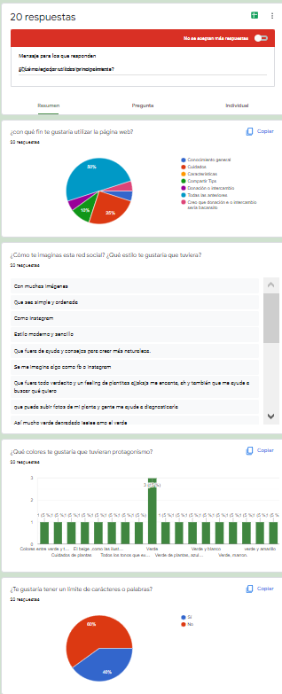

# SOCIAL NETWORK

## TEMA
Decidimos hacer una red social dirigida al usuario plant lover.

## HISTORIAS DE USUARIO
Realizamos [encuesta](https://forms.gle/XSyVXW6R4GUgGgra6) para recabar información.
Resumimos la información en:
1. yo como usuario quiero iniciar sesión con google, para acceder a contenido general sobre plantas.
2. yo como usuario quiero registrarme en la app, para acceder a contenido de cuidado sobre plantas.
3. yo como usuario quiero usar la app en navegador Google chrome, para participar en grupos, foros o comentarios sobre plantas.

RESULTADOS

## PALETA DE COLORES

## DESCRIPCIÓN DE PRODUCTO

## PROTOTIPO DE BAJA

## PROTOTIPO DE ALTA
Ver prototipo con interacciones [aquí](https://www.figma.com/proto/oGMhwqudUs2YRRP0nJoPxF/SOCIAL-NETWORK?node-id=3%3A3&scaling=scale-down&page-id=0%3A1&starting-point-node-id=3%3A3)

## DESARROLLO DEL PROYECTO

* Comenzamos eligiendo el tema:'plantas'.
* Creamos un Trello y un Figma para trabajar la planificación y el prototipo.
* Definimos algunas tareas en Trello y adjuntamos información.
* Comenzamos a trabajar el prototipo de baja en Excalidraw
* Elegimos nuestra paleta de colores añadiendola a trello.
* Creamos nuestro proyecto en firebase y lo unimos.
* Estructuramos nuestro DOM para comenzar a trabajar con firebase, router y templates.
* Resumimos los resultados de nuestra encuesta, dejandolo en info de trello.
* Terminamos nuestro prototipo de baja.
* Terminamos nuestro prototipo de alta.
* Comenzamos a transformar las funciones de firebase. 
* Agregamos función navigate, login y profile, para poder redirigir a cada una de esas rutas y pusimos un pequeño html para probar.
* No funcionó este primer intento y decidimos avanzar lo más posible con nuestros templates para poder ir conectando directamente firebase a cada template.
* Creamos un menú activo para moverse por la app.
* Logramos integrar la redirección para iniciar sesión con gmail.
* Logramos mostrar posts en el template de publications.
* 