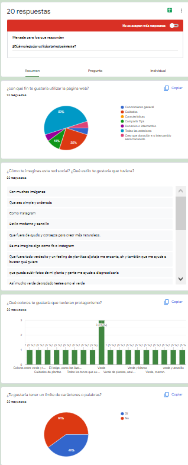

# SOCIAL NETWORK

## TEMA
Decidimos hacer una red social dirigida al usuario plant lover.

## HISTORIAS DE USUARIO
Realizamos [encuesta](https://forms.gle/XSyVXW6R4GUgGgra6) para recabar información.

RESULTADOS

* Historias de usuario
1. yo como usuario quiero participar en la app pudiendo conectar a gmail, para acceder a contenido general sobre plantas.
2. yo como usuario quiero usar la app a través de Google chrome, para participar en grupos, foros o comentarios sobre plantas.

## PALETA DE COLORES

## DESCRIPCIÓN DE PRODUCTO

## DESARROLLO DEL PROYECTO

* Comenzamos eligiendo el tema:'plantas'.
* Creamos un Trello y un Figma para trabajar la planificación y el prototipo.
* Definimos algunas tareas en Trello y adjuntamos información.
* Comenzamos a trabajar el prototipo de baja en Excalidraw
* Elegimos nuestra paleta de colores añadiendola a trello.
* Estructuramos nuestro DOM para comenzar a trabajar con firebase, router y templates.